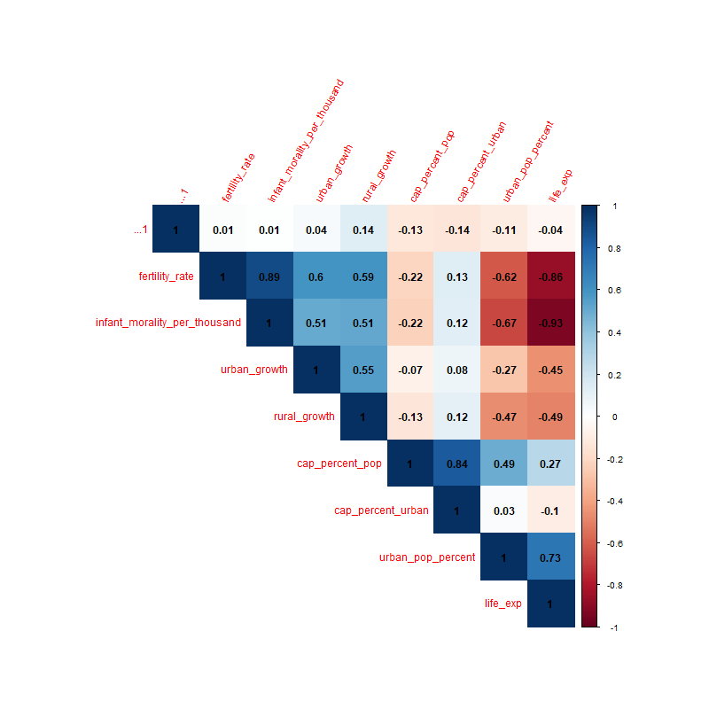
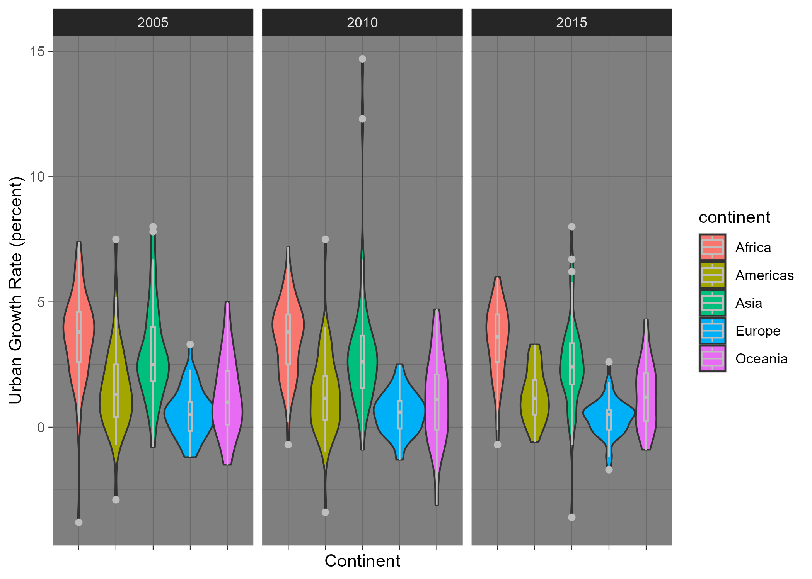
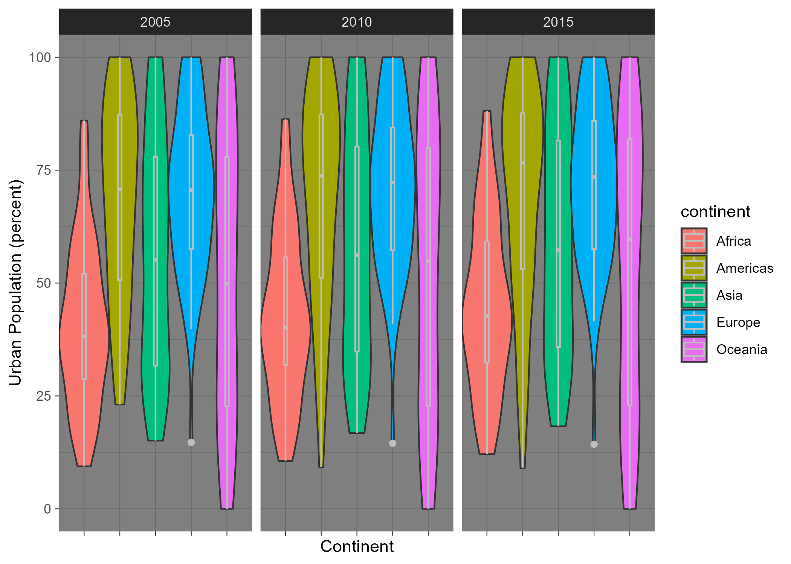
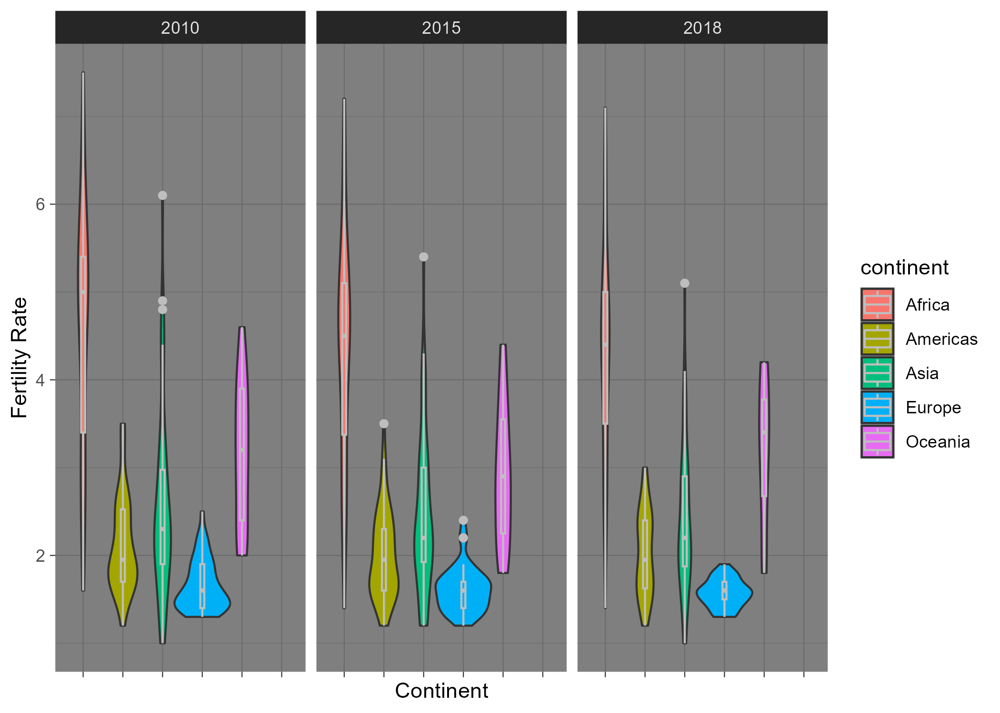
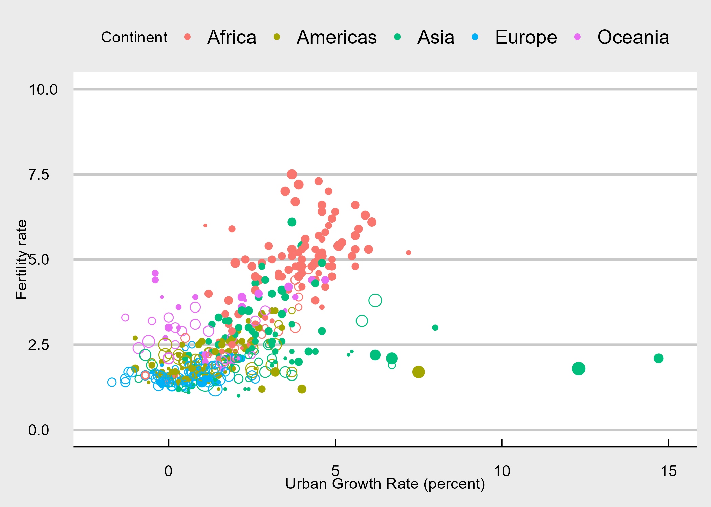
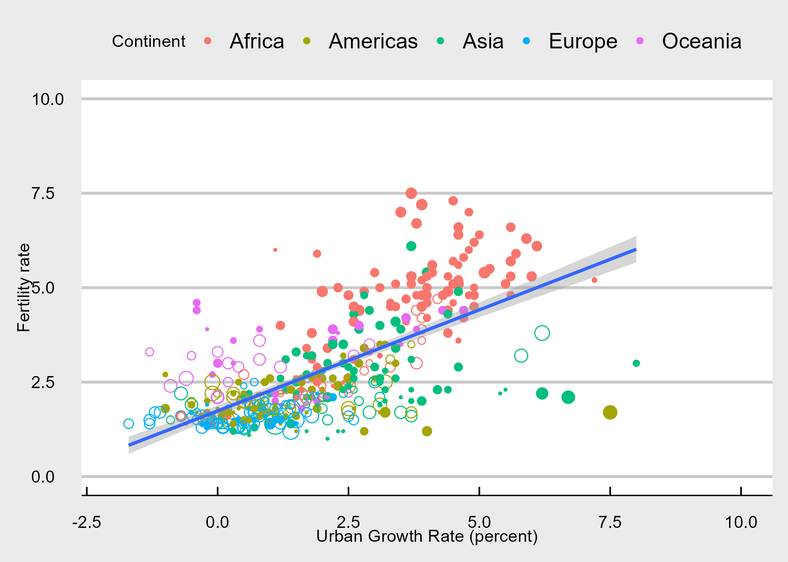
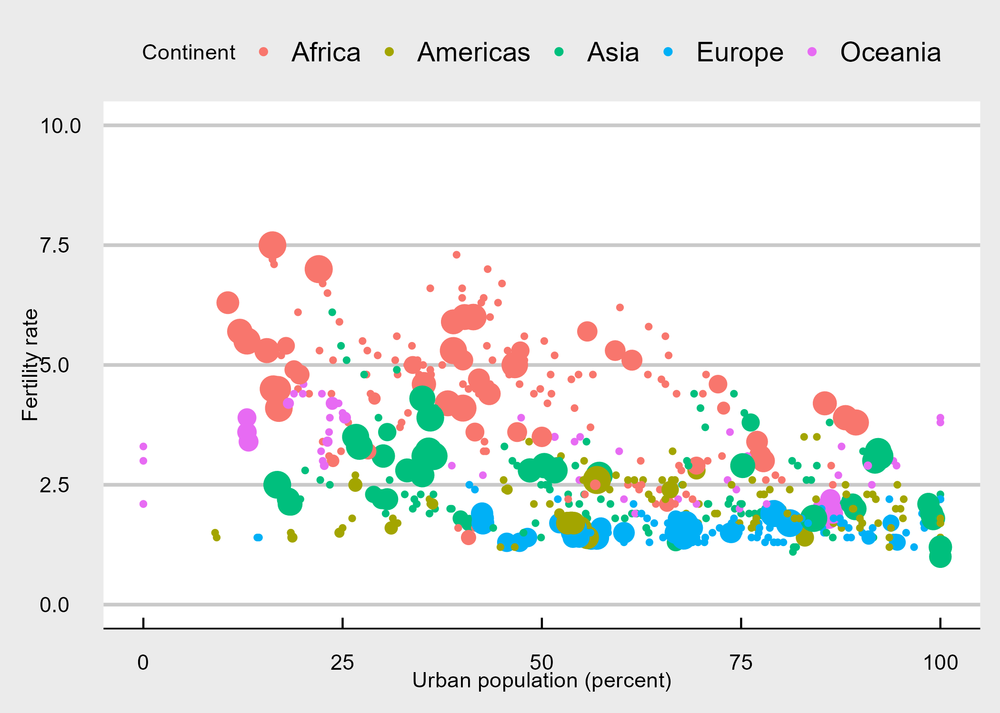

# Global-Fertility-Urbanization-Analysis
An R-based project that analyzes the connection between urbanization and fertility rates using UN provided data.

## Table of Contents

1. [Project Goal](#project-goal)
2. [Data](#data)
    - [Cleaning and Combining](#cleaning-and-combining)
3. [Visualizations](#visualizations)
    - [Urban Growth Rate Violin Plot](#urban-growth-rate-violin-plot)
    - [Urban Percent Violin Plot](#urban-percent-violin-plot)
    - [Fertility Rate Violin Plot](#fertility-rate-violin-plot)
    - [Fertility vs Urban Growth](#fertility-vs-urban-growth)
    - [Fertility vs Urban Percentage](#fertility-vs-urban-percentage)
4. [Conclusion](#conclusion)

## Project Goal

#### Resource allocation and planning

- Understanding the relationship between urbanization and fertility rates can assist in determining the demand for resources and services in both urban and rural areas. 
- This information can be used by governments and organizations to allocate resources more effectively for things such as healthcare, education, housing, and infrastructure.

#### Economic Development 

- High fertility rates can strain resources and services, while rapid urban growth may lead to challenges in providing adequate infrastructure, housing, and job opportunities. 
- Identifying these relationships can help inform strategies to promote sustainable development and economic growth.

## Data

- I obtained the data from the United Nations at data.un.org
- I used two separate datasets, one labeled “Population in the capital city, urban, and rural areas” and “Population growth, fertility, life expectancy, and mortality”.

#### Variables 

- There were several variables included in these two data sets; however, the ones we were interested in were **urban percentage**, **urban percentage growth**, **rural percentage growth**, and **fertility rate**.
- Urban percentage measures the percentage of the country living in urban areas (cities)
- Urban percentage growth measures the percentage growth of the urban areas per year  tracked over a 5-year period preceding the reference year.
- Rural percentage growth measures the percentage growth of rural areas per year  tracked over a 5-year period preceding the reference year.

<!-- -->

#### Proxies

- Urban population percentage is a proxy for the degree of urbanization, reflecting the proportion of the population living in urban areas. 
- Urban growth percentage and rural growth percentage are proxies for the rate at which urban and rural populations are changing, respectively, indicating the dynamics of urbanization over time.

#### Cleaning and Combining

- The variables of interest were under a “series” column so I used pivot_wider from `tidyr` to create separate columns and ensure the data was tidy. 
- Within each data set I dropped irrelevant data, and renamed the columns.
- Our fertility dataset had the reference year of 2022. Since the urban data set did not have this year, I used left_join when combining the datasets which drops the year within our finished dataset.
- We then used the `countrycode` so we could analyze the data pertaining to continents and subregions.
- The R code can be found [here](./cleaning_combining.R)  

## Visualizations

### Urban Growth Rate Violin Plot

<!-- -->

- Africa has the highest urban growth rate.
- The distributions get thinner each year indicating decreasing variability.

### Urban Percent Violin Plot

<!-- -->

- The Americas and Europe have the highest urban population percentage while Africa has the lowest.

### Fertility Rate Violin Plot

<!-- -->

- Africa has by far the highest fertility rate, followed by Oceania.

### Fertility vs Urban Growth 

<!-- -->

- Shape
  - Filled: positive rural growth
  - Unfilled: negative rural growth
- Size
  - absolute value of rural growth
- Fertility rate and urban growth are positively linearly correlated
  - Africa has the largest urban growth rate while Europe has the smallest
  - Urban growth in Europe is very slow, mostly between -2% to 2%
- There are some countries with negative urban growth rates.
- The two green outliers are Qatar and the United Arab Emirates

<!-- -->

- Here is the plot exlcuding Qatar and the UAE fitted with a linear model

### Fertility vs Urban Percentage 

<!-- -->

- Size
  - capital population(thousands)
- Ellipse shape
  - countries with high percent of urban population tend to have low fertility rate
  - Africa has the highest average fertility rate while Europe has the lowest
  - fertility rate and urban population percent are negatively related
- High urban population > 75%
  - Northern American, Western Europe, Australia and New Zealand
  - Variances in fertility rate and urban population percent are the smallest in Europe
- High fertility rate
  - Sub-Sarahan Africa women has more than 4 children in average

## Conclusion

### Results

- Urban percentage and urban growth rate
  - Negatively correlated
  - Developing countries are more energetic

- Negative urban growth rate
  - Positive rural growth rate: rural gentrification
    - Affluent individuals and families from urban areas to rural areas
  - Negative rural growth rate: emigration or brain drain
    - Emigration of highly skilled or educated individuals, often happens in islands

### Analysis

#### Urban percentage and urban growth rate: Negatively correlated

If developing countries are experiencing rapid urban growth, this might indicate that they are undergoing demographic transition. Demographic transition is often associated with falling fertility rates as more people move to cities, adopt urban lifestyles, and have fewer children due to factors such as cost of living, access to education, and availability of family planning resources. This trend can affect the demand for various services and resources in both urban and rural areas.

#### Negative urban growth rate and Positive rural growth rate: rural gentrification

Affluent individuals and families moving from urban to rural areas can change the demographic and economic landscape of those rural areas. This could potentially impact fertility rates in these regions due to changes in lifestyle, economic stability, and access to healthcare and education.

#### Negative urban growth rate and Negative rural growth rate: emigration or brain drain

If highly skilled or educated individuals are leaving certain areas, this could be a sign of economic or social challenges. This can have a direct impact on fertility rates, as areas with significant emigration might see a decrease in fertility rates due to reduced population in the childbearing age group. This also has implications for resource allocation, as it indicates areas that might be struggling to retain their population due to lack of opportunities or services.
