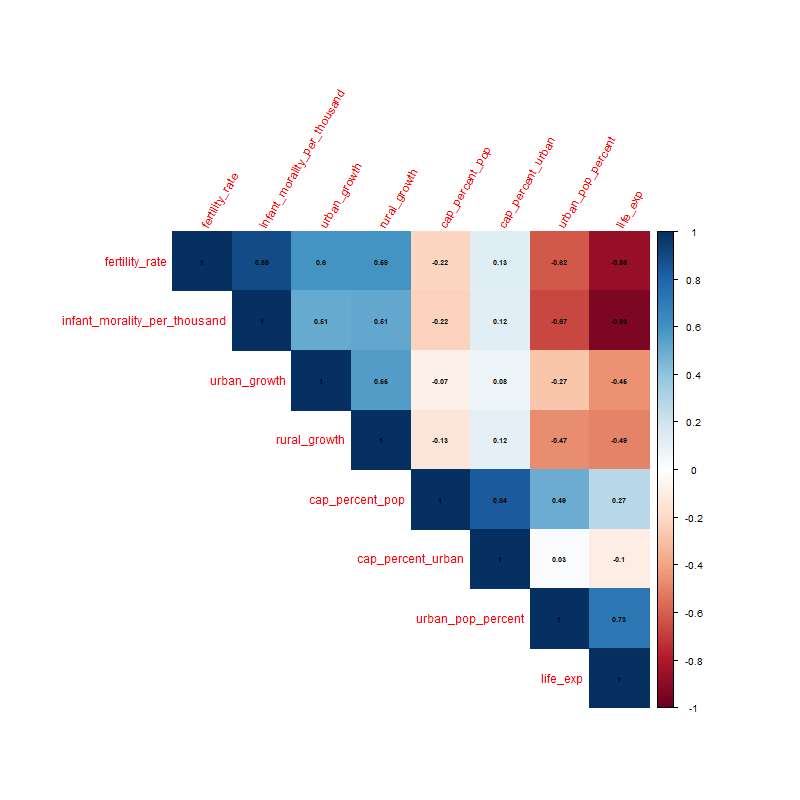
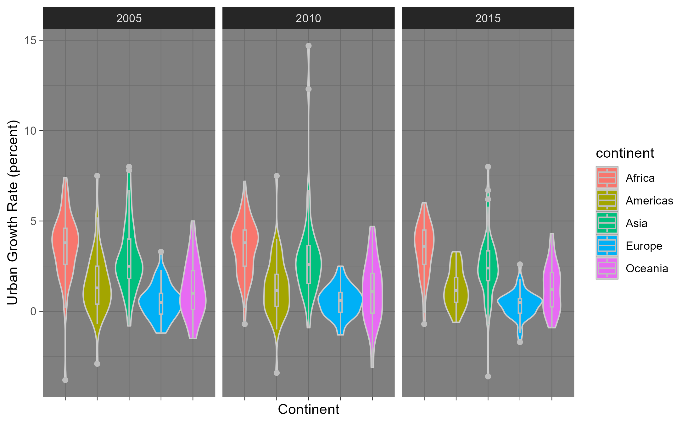
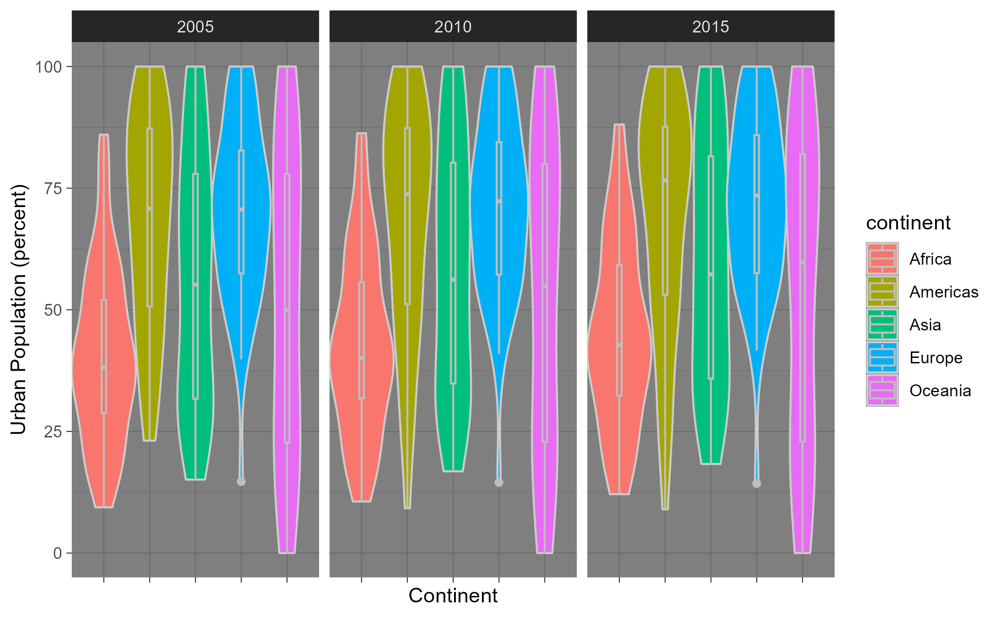
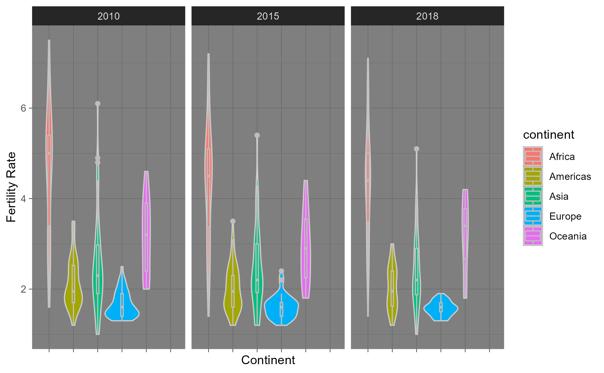
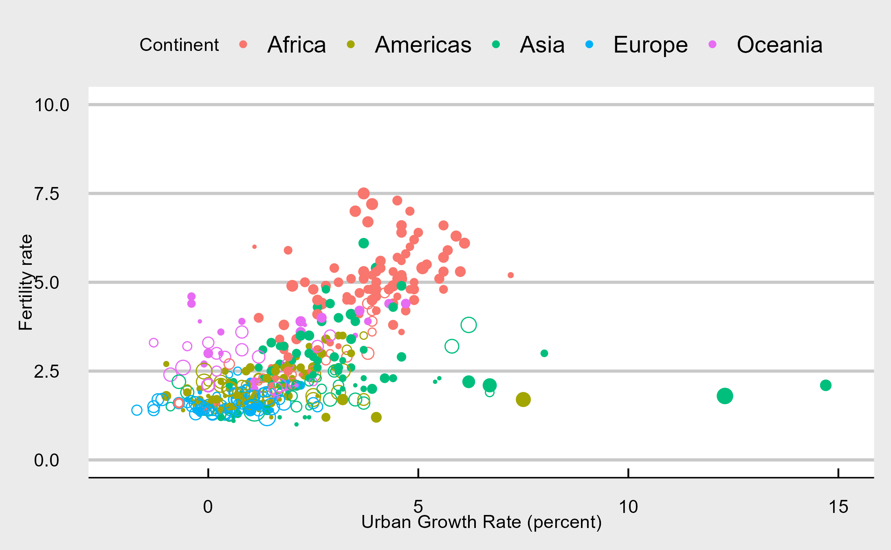
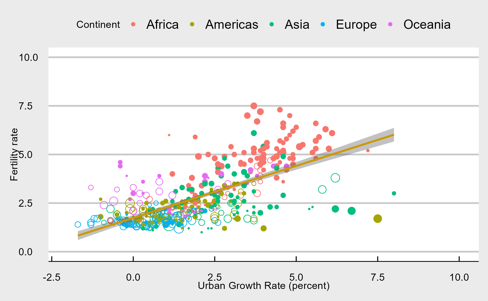
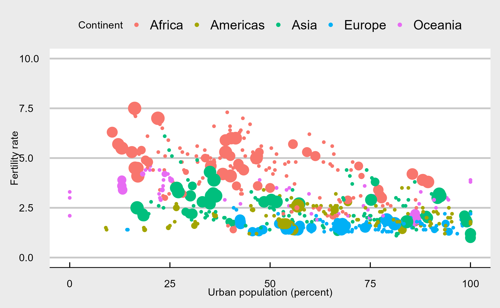

# Global-Fertility-Urbanization-Analysis
An R-based project that analyzes the connection between urbanization and fertility rates using UN provided data.

## Project Goal

#### Resource allocation and planning

- Understanding the relationship between urbanization and fertility rates can assist in determining the demand for resources and services in both urban and rural areas. 
- This information can be used by governments and organizations to allocate resources more effectively for things such as healthcare, education, housing, and infrastructure.

#### Economic Development 

- High fertility rates can strain resources and services, while rapid urban growth may lead to challenges in providing adequate infrastructure, housing, and job opportunities. 
- Identifying these relationships can help inform strategies to promote sustainable development and economic growth.

## Data

- I obtained the data from the United Nations at data.un.org
- I used two separate datasets, one labeled “Population in the capital city, urban, and rural areas” and “Population growth, fertility, life expectancy, and mortality”.

#### Variables 

- There were several variables included in these two data sets; however, the ones we were interested in were **urban percentage**, **urban percentage growth**, **rural percentage growth**, and **fertility rate**.
- Urban percentage measures the percentage of the country living in urban areas (cities)
- Urban percentage growth measures the percentage growth of the urban areas per year  tracked over a 5-year period preceding the reference year.
- Rural percentage growth measures the percentage growth of rural areas per year  tracked over a 5-year period preceding the reference year.

<!-- -->

#### Proxies

- Urban population percentage is a proxy for the degree of urbanization, reflecting the proportion of the population living in urban areas. 
- Urban growth percentage and rural growth percentage are proxies for the rate at which urban and rural populations are changing, respectively, indicating the dynamics of urbanization over time.

#### Cleaning/Combining

- The variables of interest were under a “series” column so I used pivot_wider from `tidyr` to create separate columns and ensure the data was tidy. 
- Within each data set I dropped irrelevant data, and renamed the columns.
- Our fertility dataset had the reference year of 2022. Since the urban data set did not have this year, I used left_join when combining the datasets which drops the year within our finished dataset.
- We then used the `countrycode` so we could analyze the data pertaining to continents and subregions.
- The R code can be found [here](./cleaning_combining.R)  

## Visulizations

### Urban Growth Rate Violin Plot

<!-- -->

- Africa has the highest urban growth rate.
- The distributions get thinner each year indicating decreasing variability.

### Urban Percent Violin Plot

<!-- -->

- The Americas and Europe have the highest urban population percentage while Africa has the lowest.

### Fertility Rate Violin Plot

<!-- -->

- Africa has by far the highest fertility rate, followed by Oceania.

### Fertility vs Urban Growth 

<!-- -->

- Shape
  - Filled: positive rural growth
  - Unfilled: negative rural growth
- Size
  - absolute value of rural growth
- Fertility rate and urban growth are positively linearly correlated
  - Africa has the largest urban growth rate while Europe has the smallest
  - Urban growth in Europe is very slow, mostly between -2% to 2%
- There are some countries with negative urban growth rates.
- The two green outliers are Qatar and the United Arab Emirates

<!-- -->

- Here is the plot exlcuding Qatar and the UAE fitted with a linear model

### Fertility vs Urban Percentage 

<!-- -->

