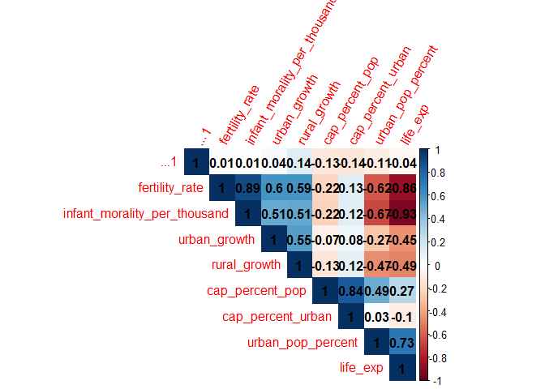
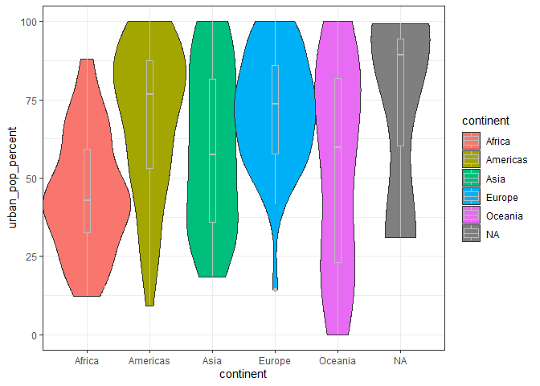
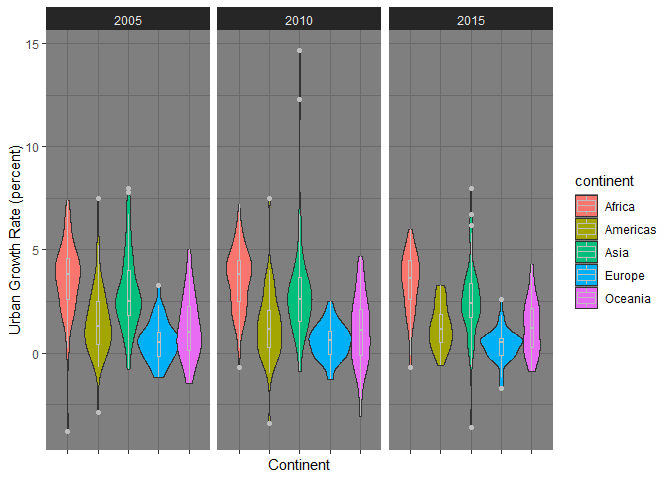

EDA
================
Connor King

- [Correlation plot](#correlation-plot)
- [Urban Data](#urban-data)
  - [2005](#2005)
  - [2010](#2010)
  - [2015](#2015)
  - [Yearly Comparison](#yearly-comparison)
- [Fertility Data](#fertility-data)
- [Fertility vs Urban Percent](#fertility-vs-urban-percent)
- [Fertility vs Urban Growth Rate](#fertility-vs-urban-growth-rate)
  - [Linear Regression Plot](#linear-regression-plot)

``` r
library(tidyverse)
```

    ## ── Attaching core tidyverse packages ──────────────────────── tidyverse 2.0.0 ──
    ## ✔ dplyr     1.1.2     ✔ readr     2.1.4
    ## ✔ forcats   1.0.0     ✔ stringr   1.5.0
    ## ✔ ggplot2   3.4.2     ✔ tibble    3.2.1
    ## ✔ lubridate 1.9.2     ✔ tidyr     1.3.0
    ## ✔ purrr     1.0.1     
    ## ── Conflicts ────────────────────────────────────────── tidyverse_conflicts() ──
    ## ✖ dplyr::filter() masks stats::filter()
    ## ✖ dplyr::lag()    masks stats::lag()
    ## ℹ Use the ]8;;http://conflicted.r-lib.org/conflicted package]8;; to force all conflicts to become errors

``` r
fertility_data <- read_csv("fertility data.csv")
```

    ## New names:
    ## Rows: 6655 Columns: 7
    ## ── Column specification
    ## ──────────────────────────────────────────────────────── Delimiter: "," chr
    ## (7): T04, Population growth and indicators of fertility and mortality, ....
    ## ℹ Use `spec()` to retrieve the full column specification for this data. ℹ
    ## Specify the column types or set `show_col_types = FALSE` to quiet this message.
    ## • `` -> `...3`
    ## • `` -> `...4`
    ## • `` -> `...5`
    ## • `` -> `...6`
    ## • `` -> `...7`

``` r
urban_data <- read_csv("urban data.csv")
```

    ## New names:
    ## Rows: 4166 Columns: 9
    ## ── Column specification
    ## ──────────────────────────────────────────────────────── Delimiter: "," chr
    ## (9): T03, Population and rates of growth in urban areas and capital citi...
    ## ℹ Use `spec()` to retrieve the full column specification for this data. ℹ
    ## Specify the column types or set `show_col_types = FALSE` to quiet this message.
    ## • `` -> `...3`
    ## • `` -> `...4`
    ## • `` -> `...5`
    ## • `` -> `...6`
    ## • `` -> `...7`
    ## • `` -> `...8`
    ## • `` -> `...9`

``` r
df <- read_csv("combined_data.csv")
```

    ## New names:
    ## Rows: 929 Columns: 19
    ## ── Column specification
    ## ──────────────────────────────────────────────────────── Delimiter: "," chr
    ## (4): country, continent, region, sign dbl (14): ...1, year, urban_pop_percent,
    ## urban_growth, rural_growth, cap_per... num (1): cap_city_pop
    ## ℹ Use `spec()` to retrieve the full column specification for this data. ℹ
    ## Specify the column types or set `show_col_types = FALSE` to quiet this message.
    ## • `` -> `...1`

``` r
df$capital_pop = as.numeric(df$cap_city_pop)
df$urban_pop_percent = as.numeric(df$urban_pop_percent)
df$urban_growth = as.numeric(df$urban_growth)
df$rural_growth = as.numeric(df$rural_growth)
df$cap_percent_pop = as.numeric(df$cap_percent_pop)
df$fertility_rate = as.numeric(df$fertility_rate)
```

Creating a df for each year for visualization purposes:

``` r
df_05 <- df %>% 
  filter(year == 2005)

df_10 <- df %>% 
  filter(year == 2010)

df_15 <- df %>% 
  filter(year == 2015)

df_18 <- df %>% 
  filter(year == 2018)
```

## Correlation plot

``` r
library(corrplot)
```

    ## corrplot 0.92 loaded

``` r
corr_plot_data <- df %>% 
  select(-country, -year, -gender_ratio_lifeexp, -continent, -region, -cap_city_pop, -capital_pop, -capital_pop_sign, -capital_pop1, -sign)

corr_plot_data <- na.omit(corr_plot_data)

corr_matrix <- cor(corr_plot_data)

corrplot(corr_matrix, 
         method = "color",  
         type = "upper", 
         order = "hclust",
         diag = TRUE,
         addCoef.col = TRUE,
         number.cex = 1,
         tl.srt = 60)
```

<!-- -->

``` r
png(file="corrplot2.png", width=800, height=800)

corrplot(corr_matrix, 
         method = "color",  
         type = "upper", 
         order = "hclust",
         diag = TRUE,
         addCoef.col = TRUE,
         number.cex = 1,
         tl.srt = 60)

dev.off()
```

    ## png 
    ##   2

Fertility rate has a high correlation urban growth and rural growth. It
also has a negative correlation with urban population percentage life
expectancy.

## Urban Data

### 2005

``` r
df_05 %>% 
  group_by(continent) %>% 
  summarize(
    n = n(),
    mean = mean(urban_growth),
    std = sd(urban_growth),
    median = median(urban_growth),
    min = min(urban_growth),
    max = max(urban_growth)
    )
```

    ## # A tibble: 6 × 7
    ##   continent     n  mean   std median   min   max
    ##   <chr>     <int> <dbl> <dbl>  <dbl> <dbl> <dbl>
    ## 1 Africa       57 3.59  1.83     3.8  -3.8   7.4
    ## 2 Americas     52 2.06  4.20     1.3  -2.9  29.3
    ## 3 Asia         50 2.93  1.93     2.5  -0.8   8  
    ## 4 Europe       47 0.564 0.948    0.5  -1.2   3.3
    ## 5 Oceania      23 1.23  1.57     1    -1.5   5  
    ## 6 <NA>          3 0.967 1.50     0.9  -0.5   2.5

``` r
library(ggdark)

ug05 <- ggplot(data = df_05, aes(x = continent, y =urban_growth, fill = continent)) +
    geom_violin(width = 1.4) +
    geom_boxplot(width = 0.1, color = "grey") +
    theme_bw()

ug05
```

    ## Warning: `position_dodge()` requires non-overlapping x intervals

<!-- -->

``` r
na_countries <- df[is.na(df$continent), ]
na_countries
```

    ## # A tibble: 12 × 19
    ##     ...1 country   year urban_pop_percent urban_growth rural_growth cap_city_pop
    ##    <dbl> <chr>    <dbl>             <dbl>        <dbl>        <dbl>        <dbl>
    ##  1   165 "Channe…  2005              30.7          0.9          0.7           NA
    ##  2   166 "Channe…  2010              31.1          0.9          0.6           NA
    ##  3   167 "Channe…  2015              31            0.5          0.5           NA
    ##  4   168 "Channe…  2018              30.9         NA           NA             34
    ##  5   217 "Cura\x…  2005              90.5         -0.5          0.1           NA
    ##  6   218 "Cura\x…  2010              89.9          2.5          3.9           NA
    ##  7   219 "Cura\x…  2015              89.4          1.2          2.4           NA
    ##  8   220 "Cura\x…  2018              89.1         NA           NA            144
    ##  9   677 "R\xe9u…  2005              96.3          2.5        -16             NA
    ## 10   678 "R\xe9u…  2010              98.5          1.4        -17.1           NA
    ## 11   679 "R\xe9u…  2015              99.3          0.9        -15.6           NA
    ## 12   680 "R\xe9u…  2018              99.6         NA           NA            147
    ## # ℹ 12 more variables: cap_percent_pop <dbl>, cap_percent_urban <dbl>,
    ## #   fertility_rate <dbl>, infant_morality_per_thousand <dbl>, life_exp <dbl>,
    ## #   gender_ratio_lifeexp <dbl>, continent <chr>, region <chr>,
    ## #   capital_pop <dbl>, capital_pop_sign <dbl>, capital_pop1 <dbl>, sign <chr>

Africa has the highest average growth rate, followed by Asia. All of the
distributions appear to be normal. Europe seems have smaller variation
with its distribution. The Americas have some heavy outliers. The NA’s
for continent are only 3 island nations thus their visualization doesn’t
indicate anything useful due to the small sample size.

``` r
df_05 %>% 
  filter(continent == 'Americas' & urban_growth > 10)
```

    ## # A tibble: 1 × 19
    ##    ...1 country    year urban_pop_percent urban_growth rural_growth cap_city_pop
    ##   <dbl> <chr>     <dbl>             <dbl>        <dbl>        <dbl>        <dbl>
    ## 1   557 Montserr…  2005               9.3         29.3         -2.3           NA
    ## # ℹ 12 more variables: cap_percent_pop <dbl>, cap_percent_urban <dbl>,
    ## #   fertility_rate <dbl>, infant_morality_per_thousand <dbl>, life_exp <dbl>,
    ## #   gender_ratio_lifeexp <dbl>, continent <chr>, region <chr>,
    ## #   capital_pop <dbl>, capital_pop_sign <dbl>, capital_pop1 <dbl>, sign <chr>

``` r
ggplot(data = df_05, aes(x = continent, y =urban_pop_percent, fill = continent)) +
  geom_violin(width = 1.4) +
  geom_boxplot(width = 0.1, color = "grey") +
  theme_bw()
```

    ## Warning: `position_dodge()` requires non-overlapping x intervals

<!-- --> Americas and
Europe have higher urban population percentages. The distributions
appear to be approx normal.

### 2010

``` r
df_10 %>% 
  group_by(continent) %>% 
  summarize(
    n = n(),
    mean = mean(urban_growth),
    std = sd(urban_growth),
    median = median(urban_growth),
    min = min(urban_growth),
    max = max(urban_growth)
    )
```

    ## # A tibble: 6 × 7
    ##   continent     n  mean   std median   min   max
    ##   <chr>     <int> <dbl> <dbl>  <dbl> <dbl> <dbl>
    ## 1 Africa       57 3.53  1.53    3.8   -0.7   7.2
    ## 2 Americas     52 1.31  1.67    1.15  -3.4   7.5
    ## 3 Asia         50 3.02  2.65    2.6   -0.9  14.7
    ## 4 Europe       47 0.560 0.827   0.6   -1.3   2.5
    ## 5 Oceania      23 1.09  1.80    1.1   -3.1   4.7
    ## 6 <NA>          3 1.6   0.819   1.4    0.9   2.5

``` r
ug10 <- ggplot(data = df_10, aes(x = continent, y =urban_growth, fill = continent)) +
  geom_violin(width = 1.4) +
  geom_boxplot(width = 0.1, color = "grey") +
  theme_bw()

ug10
```

    ## Warning: `position_dodge()` requires non-overlapping x intervals

<!-- -->

``` r
df_10 %>% 
  filter(continent == 'Asia' & urban_growth > 10)
```

    ## # A tibble: 2 × 19
    ##    ...1 country    year urban_pop_percent urban_growth rural_growth cap_city_pop
    ##   <dbl> <chr>     <dbl>             <dbl>        <dbl>        <dbl>        <dbl>
    ## 1   666 Qatar      2010              98.5         14.7          3.4          524
    ## 2   871 United A…  2010              84.1         12.3          9.7          912
    ## # ℹ 12 more variables: cap_percent_pop <dbl>, cap_percent_urban <dbl>,
    ## #   fertility_rate <dbl>, infant_morality_per_thousand <dbl>, life_exp <dbl>,
    ## #   gender_ratio_lifeexp <dbl>, continent <chr>, region <chr>,
    ## #   capital_pop <dbl>, capital_pop_sign <dbl>, capital_pop1 <dbl>, sign <chr>

``` r
ggplot(data = df_10, aes(x = continent, y =urban_pop_percent, fill = continent)) +
  geom_violin(width = 1.4) +
  geom_boxplot(width = 0.1, color = "grey") +
  theme_bw()
```

    ## Warning: `position_dodge()` requires non-overlapping x intervals

<!-- -->

### 2015

``` r
df_15 %>% 
  group_by(continent) %>% 
  summarize(
    n = n(),
    mean = mean(urban_growth),
    std = sd(urban_growth),
    median = median(urban_growth),
    min = min(urban_growth),
    max = max(urban_growth)
    )
```

    ## # A tibble: 6 × 7
    ##   continent     n  mean   std median   min   max
    ##   <chr>     <int> <dbl> <dbl>  <dbl> <dbl> <dbl>
    ## 1 Africa       57 3.41  1.44    3.6   -0.7   6  
    ## 2 Americas     52 1.26  1.04    1.15  -0.6   3.3
    ## 3 Asia         50 2.51  1.92    2.4   -3.6   8  
    ## 4 Europe       47 0.387 0.758   0.5   -1.7   2.6
    ## 5 Oceania      23 1.28  1.32    1.2   -0.9   4.3
    ## 6 <NA>          3 0.867 0.351   0.9    0.5   1.2

``` r
ug15 <- ggplot(data = df_15, aes(x = continent, y =urban_growth, fill = continent)) +
  geom_violin(width = 1.4) +
  geom_boxplot(width = 0.1, color = "grey") +
  theme_bw()

ug15
```

    ## Warning: `position_dodge()` requires non-overlapping x intervals

<!-- -->

``` r
ggplot(data = df_15, aes(x = continent, y =urban_pop_percent, fill = continent)) +
  geom_violin(width = 1.4) +
  geom_boxplot(width = 0.1, color = "grey") +
  theme_bw()
```

    ## Warning: `position_dodge()` requires non-overlapping x intervals

<!-- -->

### Yearly Comparison

``` r
df_na <- subset(df, !is.na(continent))

df_na %>% 
  filter(year != 2001 & year != 2018 & urban_growth < 20) %>% 
    ggplot(aes(x = continent, y = urban_growth, fill = continent)) +
      geom_violin(width = 1.4) +
      geom_boxplot(width = 0.1, color = "grey") +
      facet_wrap(~year, nrow = 1) +
      ylab("Urban Growth Rate (percent)") +
      xlab("Continent") +
      facet_wrap(~year, nrow = 1) +
      theme_dark() +
      theme(axis.text.x = element_blank())
```

    ## Warning: `position_dodge()` requires non-overlapping x intervals
    ## `position_dodge()` requires non-overlapping x intervals
    ## `position_dodge()` requires non-overlapping x intervals

<!-- -->

``` r
ggsave("u_rate_box.png")
```

    ## Saving 7 x 5 in image

    ## Warning: `position_dodge()` requires non-overlapping x intervals
    ## `position_dodge()` requires non-overlapping x intervals
    ## `position_dodge()` requires non-overlapping x intervals

The violin plot get thinner each year indicating decreasing variability.
These can be shown in the analytical summaries.

``` r
df_na %>% 
  filter(year != 2001 & year != 2018 & urban_growth < 20) %>% 
    ggplot(aes(x = continent, y = urban_pop_percent, fill = continent)) +
      geom_violin(width = 1.4) +
      geom_boxplot(width = 0.1, color = "grey") +
      facet_wrap(~year, nrow = 1) +
      ylab("Urban Population (percent)") +
      xlab("Continent") +
      facet_wrap(~year, nrow = 1) +
      theme_dark() +
      theme(axis.text.x = element_blank())
```

    ## Warning: `position_dodge()` requires non-overlapping x intervals
    ## `position_dodge()` requires non-overlapping x intervals
    ## `position_dodge()` requires non-overlapping x intervals

<!-- -->

``` r
ggsave("u_percent_box.png")
```

    ## Saving 7 x 5 in image

    ## Warning: `position_dodge()` requires non-overlapping x intervals
    ## `position_dodge()` requires non-overlapping x intervals
    ## `position_dodge()` requires non-overlapping x intervals

## Fertility Data

``` r
df %>% 
  filter(year != 2001 & year != 2005) %>% 
    ggplot(aes(x = continent, y = fertility_rate, fill = continent)) +
      geom_violin(width = 1.4) +
      geom_boxplot(width = 0.1, color = "grey") +
      ylab("Fertility Rate") +
      xlab("Continent") +
      facet_wrap(~year, nrow = 1) +
      theme_dark() +
      theme(axis.text.x = element_blank())
```

    ## Warning: Removed 61 rows containing non-finite values (`stat_ydensity()`).

    ## Warning: Removed 61 rows containing non-finite values (`stat_boxplot()`).

    ## Warning: `position_dodge()` requires non-overlapping x intervals
    ## `position_dodge()` requires non-overlapping x intervals
    ## `position_dodge()` requires non-overlapping x intervals

<!-- -->

``` r
ggsave("f_box.png")
```

    ## Saving 7 x 5 in image

    ## Warning: Removed 61 rows containing non-finite values (`stat_ydensity()`).

    ## Warning: Removed 61 rows containing non-finite values (`stat_boxplot()`).

    ## Warning: `position_dodge()` requires non-overlapping x intervals
    ## `position_dodge()` requires non-overlapping x intervals
    ## `position_dodge()` requires non-overlapping x intervals

Africa has a much higher fertility rate than the other continents.

``` r
df %>% 
  filter(year != 2001 & year != 2005) %>% 
    ggplot(aes(x = continent, y = fertility_rate, fill = continent)) +
      geom_violin(width = 1.4) +
      geom_boxplot(width = 0.1, color = "grey") +
      facet_wrap(~year, nrow = 1) +
      theme_bw()
```

    ## Warning: Removed 61 rows containing non-finite values (`stat_ydensity()`).

    ## Warning: Removed 61 rows containing non-finite values (`stat_boxplot()`).

    ## Warning: `position_dodge()` requires non-overlapping x intervals
    ## `position_dodge()` requires non-overlapping x intervals
    ## `position_dodge()` requires non-overlapping x intervals

<!-- -->

## Fertility vs Urban Percent

``` r
library(ggthemes)

df_na <- subset(df, !is.na(continent))

df_na %>% 
  ggplot(aes(x = urban_pop_percent, y = fertility_rate, color = continent)) +
  geom_point(aes(size = capital_pop1)) +
  theme(legend.title = element_blank()) +
#  scale_shape_manual(values = c("0" = 21, "1" = 20)) +
  ylim(0, 10) +
  xlim(0, 100) +
  xlab("Urban population (percent)") +
  ylab("Fertility rate") +
  guides(shape = "none") +
  guides(size = "none") +
  labs(color = "Continent") +
  theme_economist_white()
```

    ## Warning: Removed 282 rows containing missing values (`geom_point()`).

<!-- -->

``` r
ggsave("fu_percent.png")    
```

    ## Saving 7 x 5 in image

    ## Warning: Removed 282 rows containing missing values (`geom_point()`).

- Size
  - capital population(thousands)
- Ellipse shape
  - countries with high percent of urban population tend to have low
    fertility rate
  - Africa has the highest average fertility rate while Europe has the
    lowest
  - fertility rate and urban population percent are negatively related

## Fertility vs Urban Growth Rate

``` r
df_na %>%   
  ggplot(aes(urban_growth, fertility_rate, color = continent)) +
    geom_point(aes(size = abs(rural_growth), shape = sign)) +
    theme(legend.title = element_blank()) +
    ylim(0,10) +
    xlim(-2, 15) +
    scale_shape_manual(values = c("0" = 21, "1" = 20, "missing" = 2)) +
    xlab("Urban Growth Rate (percent)") +
    ylab("Fertility rate") +
    guides(shape = "none") +
    guides(size = "none") +
    labs(color = "Continent") +
    theme_economist_white()
```

    ## Warning: Removed 468 rows containing missing values (`geom_point()`).

<!-- -->

``` r
ggsave("fu_rate.png")
```

    ## Saving 7 x 5 in image

    ## Warning: Removed 468 rows containing missing values (`geom_point()`).

- Shape
  - filled: positive rural growth
  - unfilled: negative rural growth
- Size
  - absolute value of rural growth
- Fertility rate and urban growth are positively almost linearly
  correlated
  - Africa has the largest urban growth rate while Europe has the
    smallest
  - urban growth in Europe is very slow, mostly between -2% to 2%
- There are some countries with negative urban growth rates

### Linear Regression Plot

``` r
df_o <- df_na[df_na$country != "Qatar" & df_na$country != "United Arab Emirates", ]

df_o %>%   
  ggplot(aes(urban_growth, fertility_rate)) +
    geom_point(aes(size = abs(rural_growth), color = continent, shape = sign)) +
    geom_smooth(method = "lm", se = TRUE, na.rm = TRUE) +
    theme(legend.title = element_blank()) +
    ylim(0,10) +
    xlim(-2, 10) +
    scale_shape_manual(values = c("0" = 21, "1" = 20, "missing" = 2)) +
    xlab("Urban Growth Rate (percent)") +
    ylab("Fertility rate") +
    guides(shape = "none") +
    guides(size = "none") +
    labs(color = "Continent") +
    theme_economist_white()
```

    ## `geom_smooth()` using formula = 'y ~ x'

    ## Warning: Removed 464 rows containing missing values (`geom_point()`).

<!-- -->

``` r
ggsave("fu_growth_line.png")
```

    ## Saving 7 x 5 in image
    ## `geom_smooth()` using formula = 'y ~ x'

    ## Warning: Removed 464 rows containing missing values (`geom_point()`).
